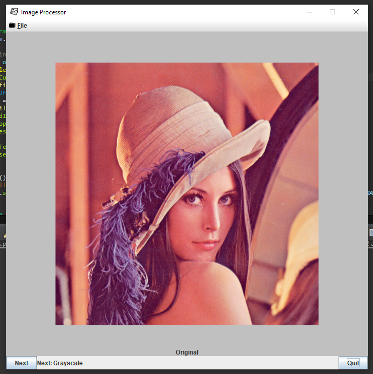
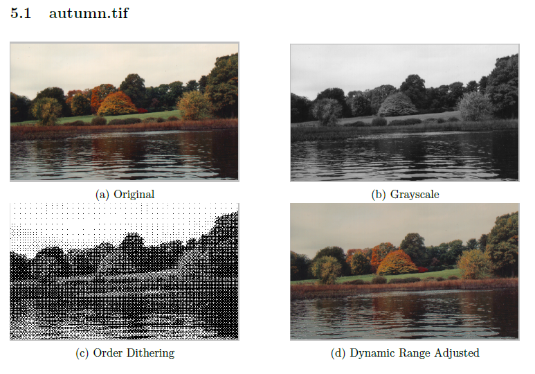
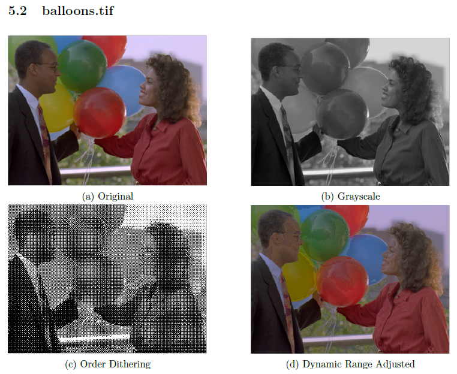
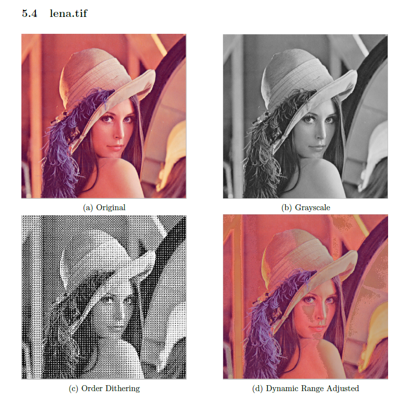

<h1> ImageProcessor </h1>

<h2> An application that can decode tiff images and generate different visual effects </h2>

<h2>demo video: https://youtu.be/TQoIQjb57Xk</h2>

<h3>To run the executable</h3> 
<ol>
<li>Download Executable.zip.</li>

<li>Extract the zip file.</li>

<li> To run the jar file in command line, simpily type in "java -jar processor.jar", no input arguments required. (java installation required.)</li>
</ol>

The project is inside the "ImageProcessiingProject" directory

<h3>note: please put the executable file with "icons" folder and "images" folder in the same directory.</h3>

<h2>Interface:</h2>

<h2>Results:</h2>

